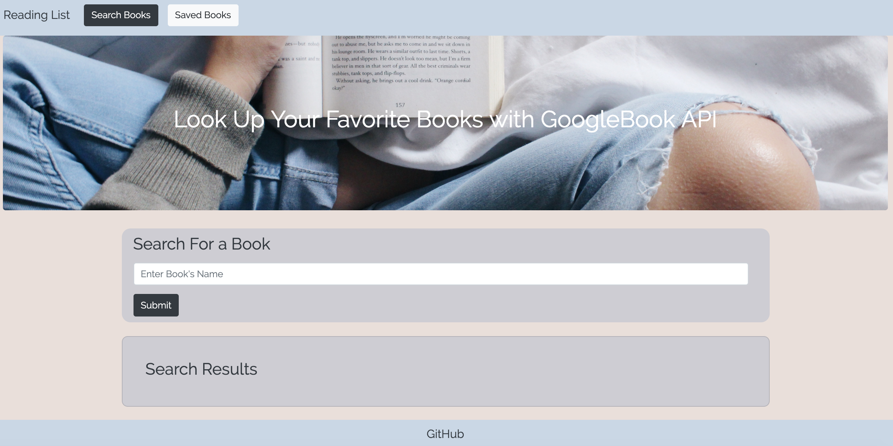
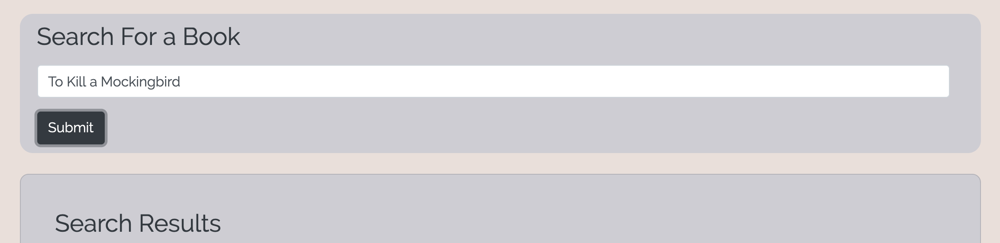
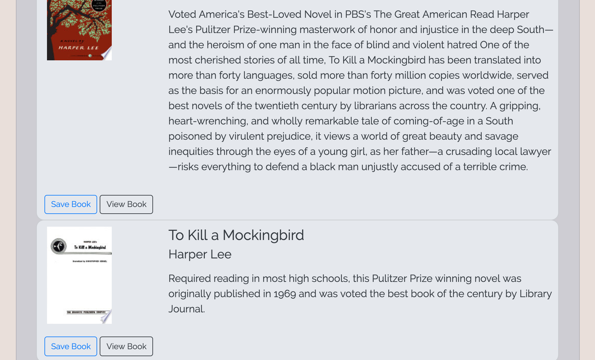
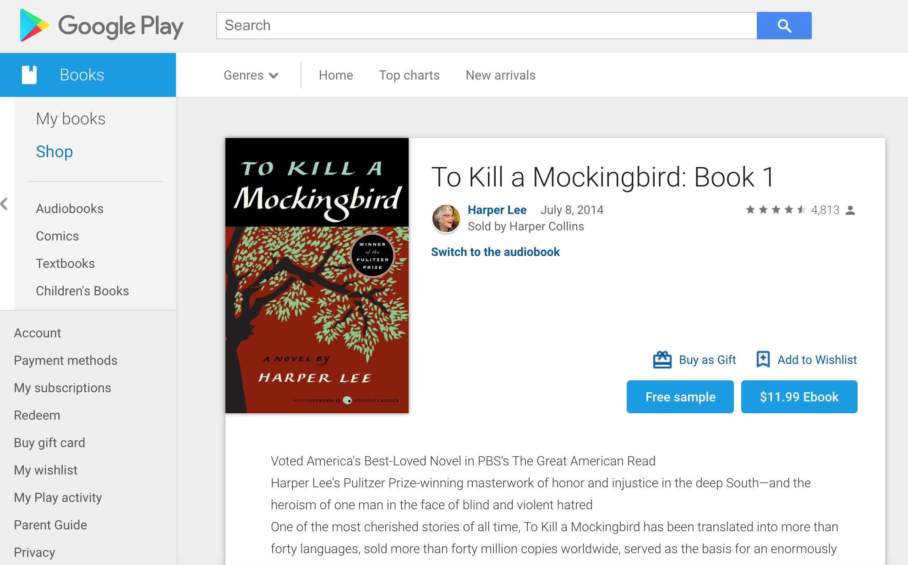
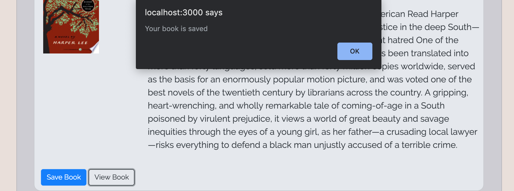
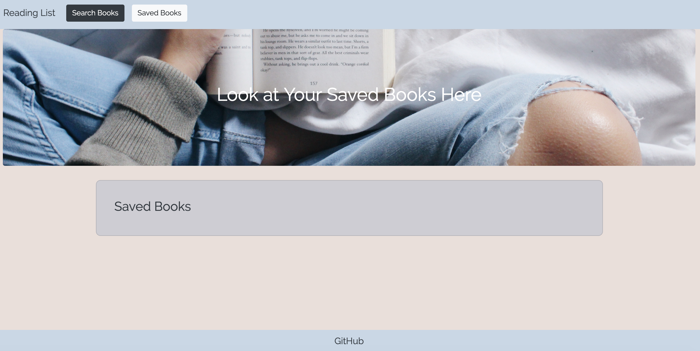
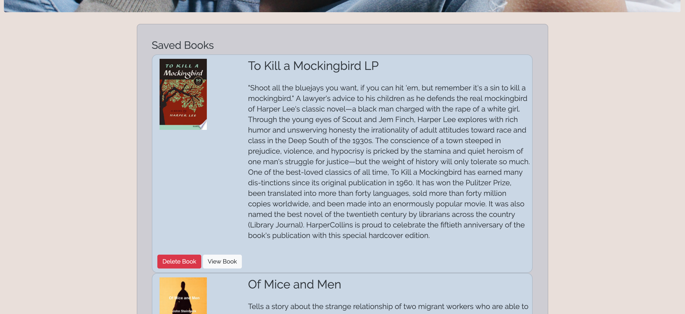

# googlebooksearch

## Contributor
Jenni Birsan //
IG: jennibirsan

## About
This mongoose article scraper grabs articles from Buzzfeed News and places them on this webpage. Once you scrape the articles, they are saved to the mongoDB. You can save these articles and access them later in the "Saved Articles" landing page. In the Saved Articles landing page, you can add notes to the article and you can delete it from your saved queue. 

## Modules Used
* React JS
* Javascript
* JSX
* CSS
* HTML
* Mongoose/MongoDB
* Express/Node JS

## Database Used
mLab MongoDB connected to Robo 3T

## Heroku Link
(INSERT HERE)

## Home Page
(this is the webpage before searching for books)

## Search Input
(In the input text box, you can search your favorite book)

## Search Results
(The GoogleBooks API Displays results)

## 'View Book' Link
(If you click the 'View Book' button, it will lead you to the Google Books webpage for that specific book)

## 'Save Book' Link
(If you click the 'Save Book' button, it save that search and alert you that the book has been saved)

## Saved Books Page - Blank
(picture of saved books page // before saving any books to the list)

## Saved Books Page
(picture of the Saved Books -- you can either 'View Book' in the Google Books website or 'Delete' from your list)

